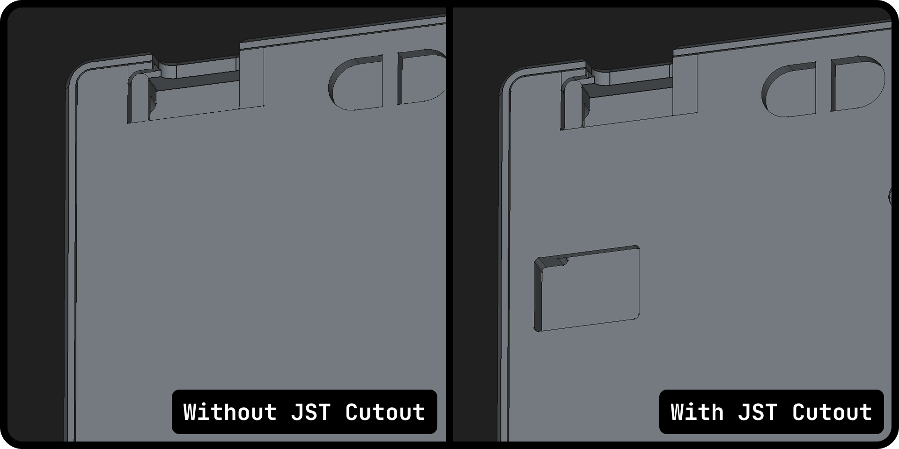

**English** | [简体中文](./internationalization/Chinese/essential_files.md) | [Русский](./internationalization/Russian/essential_files.md)

# Where is the PCB Gerber file?

You can find these files in their respective directories based on keyboard size:

```
pcb/<keyboard-size>/production/
```

Download the appropriate Gerber files for your keyboard version:

- [Flake S/M](https://github.com/anywhy-io/flake/blob/main/pcb/M%2CS/production/Flake.zip)
- [Flake L](https://github.com/anywhy-io/flake/blob/main/pcb/L/production/Flake-L.zip)
  
# Where are the Enclosure files?

Enclosure files are organized by keyboard size in the following directory structure:

```
enclosure/<keyboard-size>/
```

Select the enclosure files matching your keyboard version:

- [Flake S](https://github.com/anywhy-io/flake/tree/main/enclosure/S)
- [Flake M](https://github.com/anywhy-io/flake/tree/main/enclosure/M)
- [Flake L](https://github.com/anywhy-io/flake/tree/main/enclosure/L)

There you can also find a variant of back plate with cutout for battery connector.




