[English](../../build_guide.md) | [简体中文](../Chinese/build_guide.md) | **Русский**

# Руководство по сборке клавиатуры Flake

Добро пожаловать в официальное руководство по сборке клавиатуры Flake! Это руководство создано так, чтобы быть исчерпывающим и простым для понимания, даже если вы собираете клавиатуру впервые.

Рекомендую прочитать всё руководство целиком, прежде чем начинать, чтобы ознакомиться с процессом.

## Подготовка

Прежде чем приступить к пайке или сборке, убедитесь, что у вас есть все необходимые компоненты и инструменты.

### Необходимые инструменты
*   **Паяльник:** Качественный паяльник с регулируемой температурой обязателен.
*   **Припой:** Настоятельно рекомендуется использовать бессвинцовый припой для безопасности и здоровья.
*   **Флюс:** Флюс-карандаш или паста значительно облегчат пайку.
*   **Пинцет:** Необходим для работы с мелкими компонентами.
*   **Отвёртка:** Для винтов M2, используемых в корпусе.
*   **(Опционально) Мультиметр:** Полезен для поиска неисправностей.

### Необходимые файлы
Вам понадобятся производственные файлы для печатной платы (PCB) и корпуса. Все необходимые файлы и инструкции по их заказу вы можете найти здесь:
➡️ **[Основные файлы и руководство по заказу](essential_files.md)**

### Список компонентов (BOM)

Необходимые компоненты зависят от размера клавиатуры, которую вы собираете. Количество клавиш для каждого размера:
*   **Маленький (Small):** 40 клавиш
*   **Средний (Medium):** 46 клавиш
*   **Большой (Large):** 58 клавиш

| Компонент | Маленький (40) | Средний (46) | Большой (58) | Примечания |
|:---|:---:|:---:|:---:|:---|
| **Компоненты для пайки** | | | | |
| Anywhy Flake v2 PCB | 2 | 2 | 2 | По одной для каждой половины |
| Seeed Xiao nRF52840 | 2 | 2 | 2 | Микроконтроллер |
| JST 1.25 SMD 2pin коннектор | 2 | 2 | 2 | Для аккумулятора |
| Хот-свап сокеты MX | 40 | 46 | 58 | См. примечание ниже |
| Хот-свап сокеты Choc | 40 | 46 | 58 | См. примечание ниже |
| Диоды 1N4148 | 40 | 46 | 58 | 1 на свитч (SOD-123 или SOD-323) |
| **Компоненты для сборки** | | | | |
| Спаянная PCB | 2 | 2 | 2 | Из предыдущего шага |
| Свитчи (Choc v1/v2 или MX) | 40 | 46 | 58 | 1 на сокет |
| Кейкапы | 40 | 46 | 58 | Должны быть совместимы с вашими свитчами |
| Корпус | 1 компл. | 1 компл. | 1 компл. | Включает верхнюю и нижнюю части для каждой половины |
| LiPo аккумулятор 502030 | 2 | 2 | 2 | Или меньше, с разъёмом JST 1.25 |
| Резиновые ножки 6x2мм | 8 | 8 | 8 | |
| Стойки M2x4мм | 6 | 8 | 8 | |
| Винты M2x8мм с потайной головкой | 12 | 16 | 16 | например, DIN965 |

> [!NOTE]
> **Сокеты:** PCB Flake поддерживает одновременно и MX, и Choc свитчи. В этом руководстве показано, как припаять оба типа сокетов для максимальной гибкости. Если вы уверены, что будете использовать только один тип свитчей, вы можете припаять только соответствующие сокеты (MX или Choc) и пропустить установку другого набора.

---

## 1. Пайка PCB

Это самая кропотливая часть сборки. Не торопитесь, работайте в хорошо проветриваемом помещении и перепроверяйте свою работу по ходу дела.

### Подготовка

#### A. Особенности реверсивной PCB

В Flake используется **реверсивная PCB**. Это означает, что вы используете одну и ту же плату для левой и правой половин — просто переворачиваете одну из них. Процесс сборки идентичен для обеих половин. Это руководство проведёт вас через сборку одной половины. **Просто повторите все шаги на второй PCB, убедившись, что она перевёрнута на противоположную сторону.**

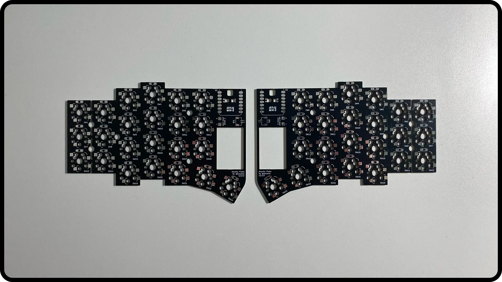

#### B. Очистка отверстий под контроллером
Из-за производственного процесса отверстия для ножек контроллера могут быть частично заблокированы. Перед установкой контроллера необходимо аккуратно очистить эти отверстия кончиком пинцета.

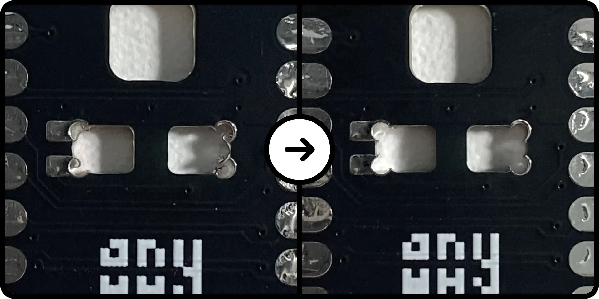

#### C. Отламывание части PCB (только для маленькой версии)
Если вы собираете 40-клавишную **маленькую (Small)** версию, как я в этом руководстве, вы должны отломить внешний столбец для мизинца на обеих платах. **Если вы собираете среднюю (Medium) или большую (Large) версию, пропустите этот шаг и оставьте платы целыми.**

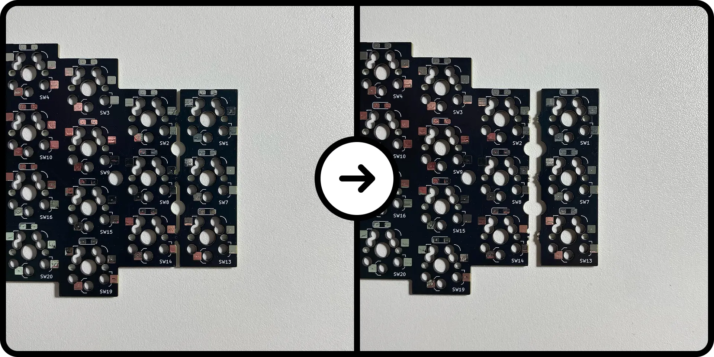

#### D. Подготовка компонентов
Разложите PCB и компоненты, которые вы будете паять для одной половины.

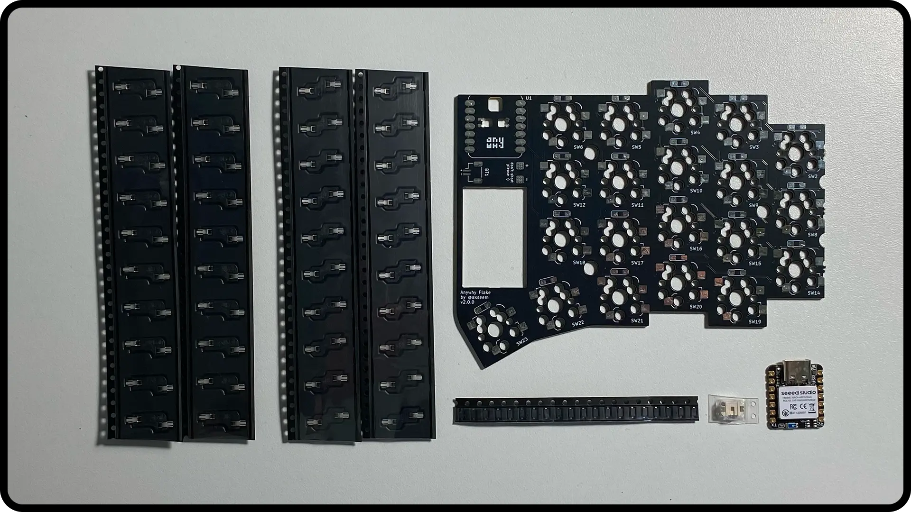

### Шаг 1: Коннектор аккумулятора (JST)

> [!TIP]
> Если у вашего аккумулятора нет разъёма JST, вы можете припаять его напрямую к площадкам `RAW` (+) и `GND` (-) рядом с местом для JST. Однако это не рекомендуется, так как в будущем будет сложно заменить аккумулятор.

1. Установите коннектор JST 1.25 на его посадочное место `BT1`.
2. Припаяйте две большие монтажные площадки, чтобы закрепить коннектор.
3. Припаяйте два маленьких контакта.

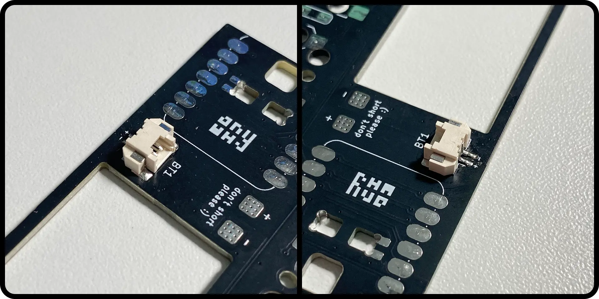

### Шаг 2: Контроллер (Seeed Xiao)

> [!IMPORTANT]
> Правильное выравнивание критически важно. Неправильно установленный контроллер может помешать установке клавиатуры в корпус.

1.  Установите контроллер Xiao на его посадочное место в контуре `U1`. Порт USB-C должен быть направлен наружу.
2.  Припаяйте **один угловой контакт**, чтобы зафиксировать контроллер на месте.
3.  Проверьте выравнивание. Если он стоит криво, разогрейте припой и поправьте его.
4.  После выравнивания припаяйте **противоположный по диагонали угловой контакт**, чтобы закрепить его.

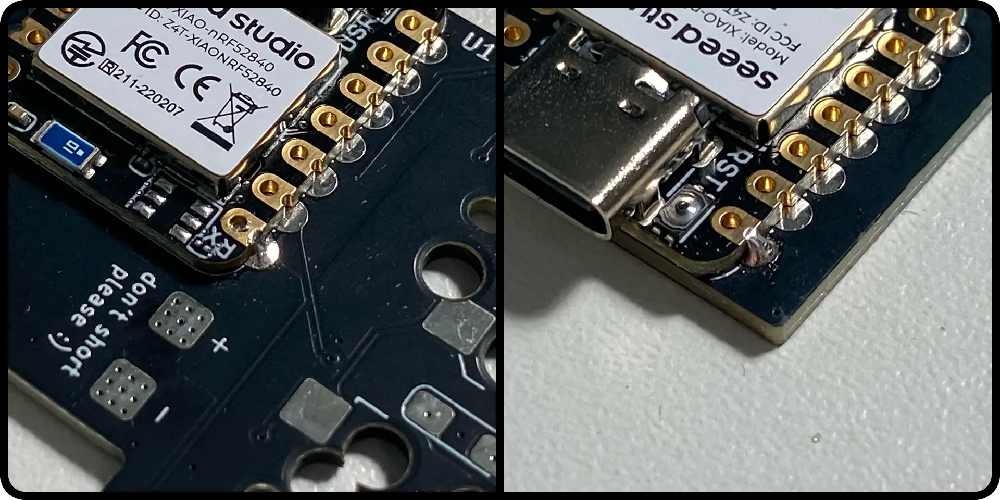

5.  Припаяйте все остальные контакты.

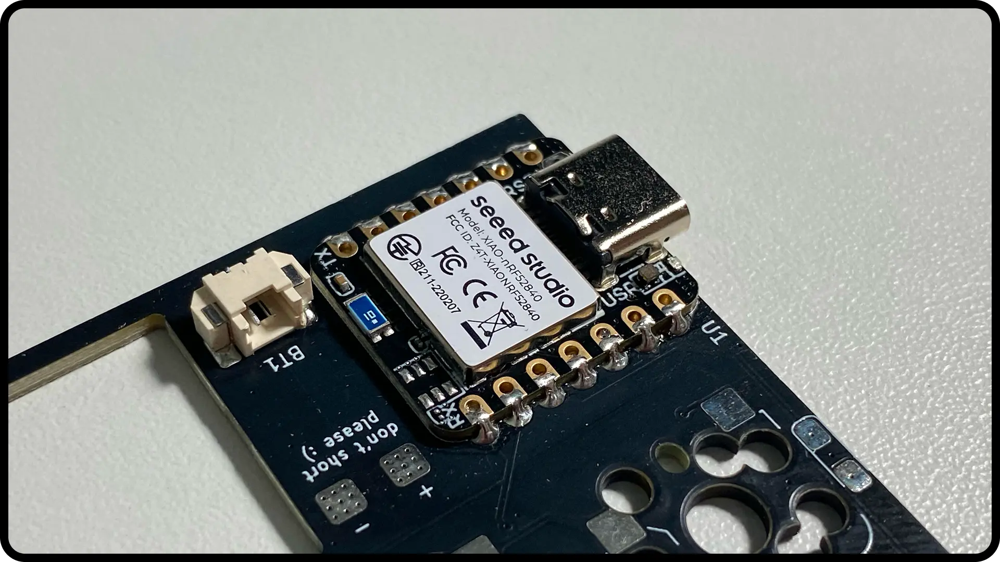

6.  Переверните плату и припаяйте площадки `RAW` и `GND` под контроллером.

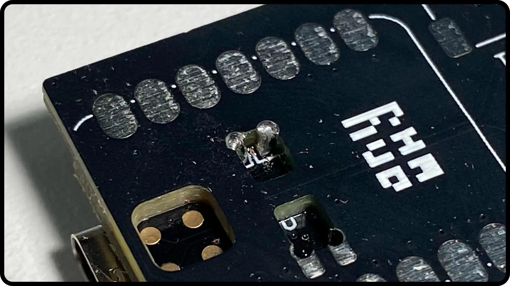

### Шаг 3: Диоды

> [!WARNING]
> Диоды имеют направление! Линия на диоде должна совпадать с линией на шелкографии PCB. Неправильно ориентированный диод приведёт к тому, что клавиша не будет работать.

Для каждого места под свитч:
1.  Нанесите небольшое количество припоя на одну из двух площадок для диода.
2.  С помощью пинцета установите диод на место, разогревая каплю припоя, чтобы закрепить одну сторону. **Убедитесь, что линия на диоде совпадает с линией на контуре PCB.**
3.  Припаяйте вторую ножку диода.

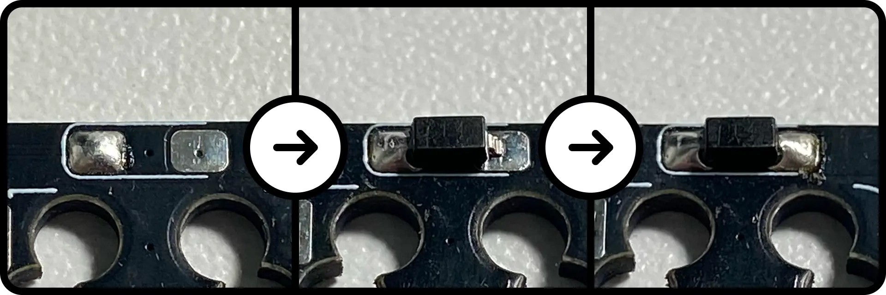

### Шаг 4: Хот-свап сокеты

Для каждого места под свитч:
1.  Установите **сокет MX** в верхнюю позицию и **сокет Choc** в нижнюю.
2.  Припаяйте обе металлические ножки на каждом сокете.

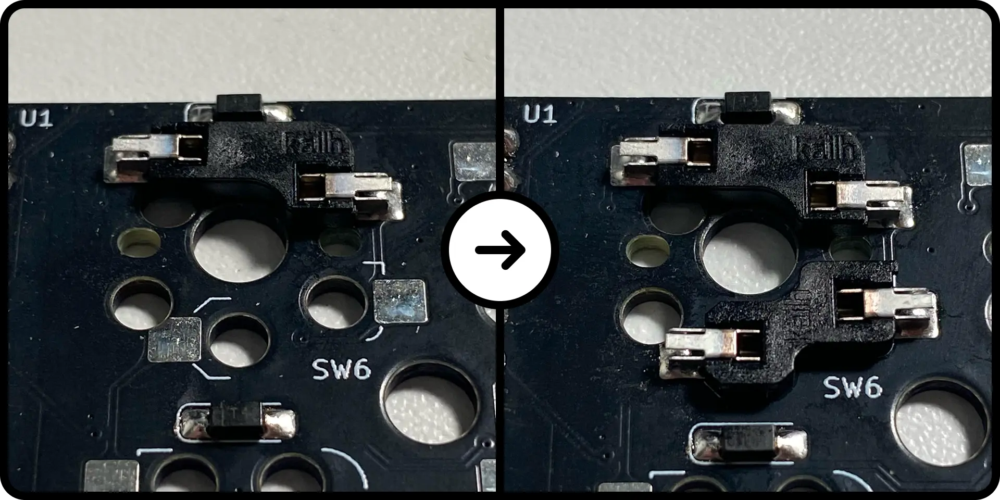

### Пайка завершена!
Поздравляем! Вы полностью спаяли PCB. Уделите минуту, чтобы проверить все паяные соединения.

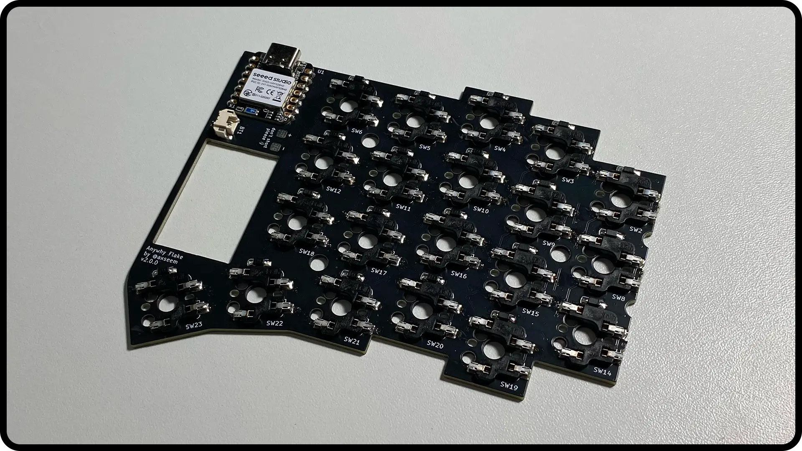

Теперь повторите весь процесс пайки для второй PCB. Не забудьте работать на **противоположной стороне** платы, чтобы она стала **зеркальным отражением** первой половины.

## 2. Сборка корпуса

Когда обе платы спаяны, пора поместить всё в корпус.

1.  Соберите спаянную PCB, части корпуса, аккумулятор, стойки и винты.

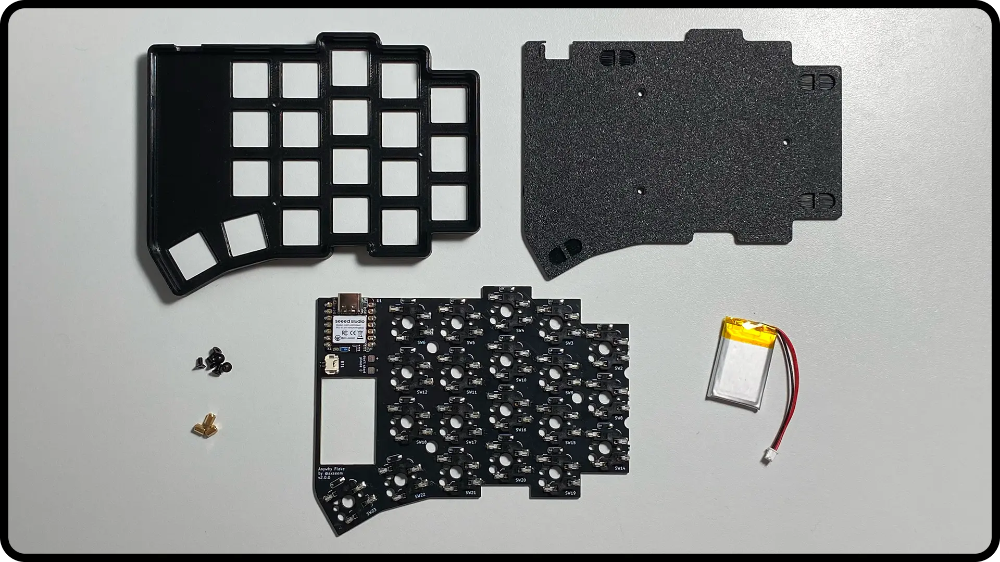

2.  Вкрутите стойки M2x4мм в **нижнюю половину** корпуса.

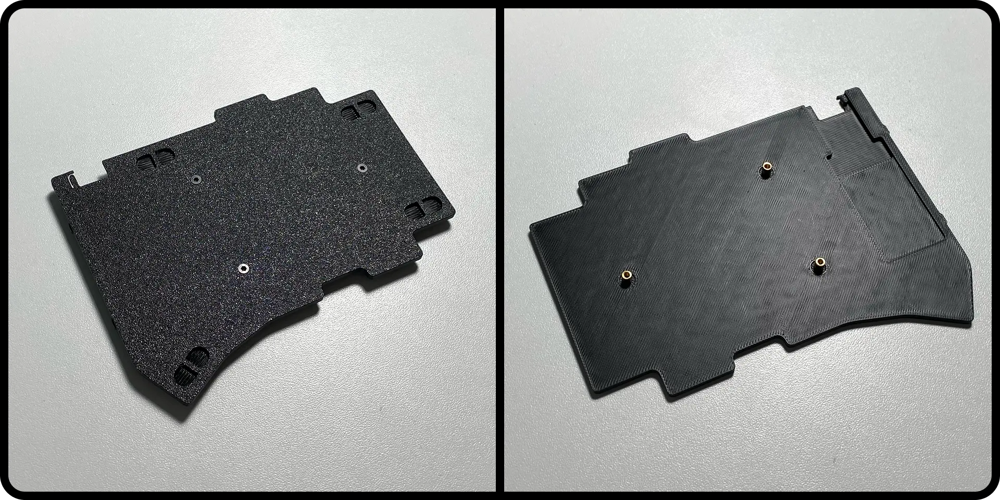

3.  Установите спаянную PCB в **верхнюю половину** корпуса. Подключите разъём JST аккумулятора и поместите аккумулятор в специальный вырез.

> [!WARNING]
> **Безопасность аккумулятора:** Трижды проверьте полярность перед подключением аккумулятора. Подключение с обратной полярностью (красный провод к `GND (-)`, чёрный к `RAW (+)`) уничтожит микроконтроллер.

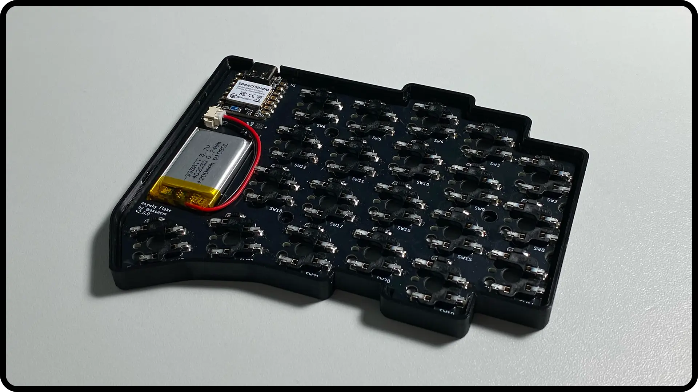

4.  Аккуратно поместите нижнюю пластину на верхнюю часть, совмещая отверстия со стойками. Приклейте самоклеящиеся резиновые ножки на специальные места на дне корпуса.

> [!TIP]
> Для второй половины приклейте ножки на противоположные углы. Это позволит обеим половинам плотно прилегать друг к другу для транспортировки.

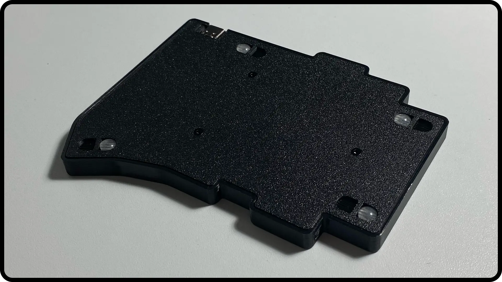

5. Вставьте винты M2x8мм сверху и затяните их. Не перетягивайте.

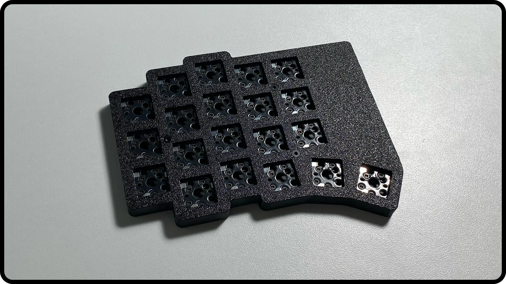

**Повторите** этот процесс сборки для второй половины клавиатуры.

## 3. Финальная сборка

> [!IMPORTANT]
> Если вы используете свитчи MX, вы должны установить прилагаемую MX-плейт на клавиатуру *перед* установкой свитчей.

1.  **Установка свитчей:** Аккуратно вставьте выбранные вами свитчи (MX или Choc) в соответствующие хот-свап сокеты. Убедитесь, что ножки свитчей прямые, чтобы не погнуть их.

2.  **Установка кейкапов:** Плотно наденьте кейкапы на стемы свитчей.

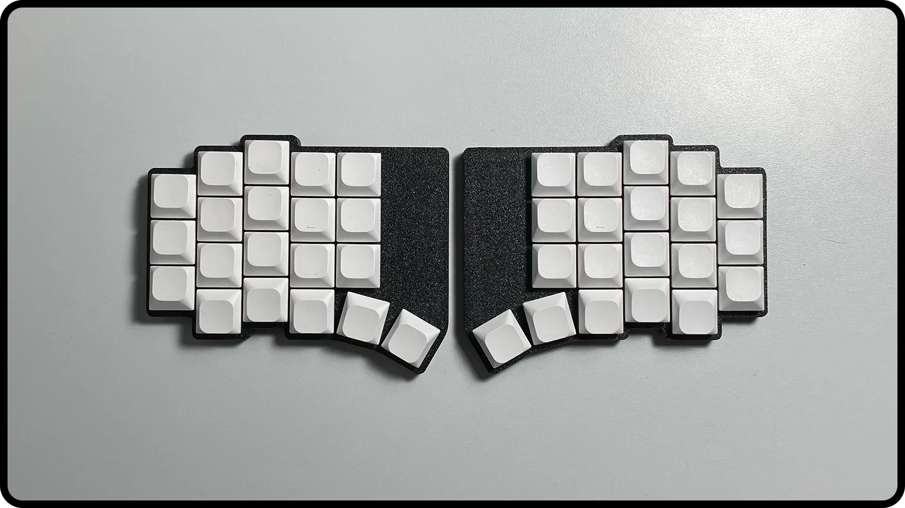

## Готово!
Поздравляем со сборкой вашей клавиатуры Flake! Теперь ваша клавиатура физически завершена.

Последний шаг — прошить прошивку, чтобы сделать её полностью функциональной. Пожалуйста, перейдите к следующему руководству:
➡️ **[Руководство по прошивке](flashing_guide.md)**