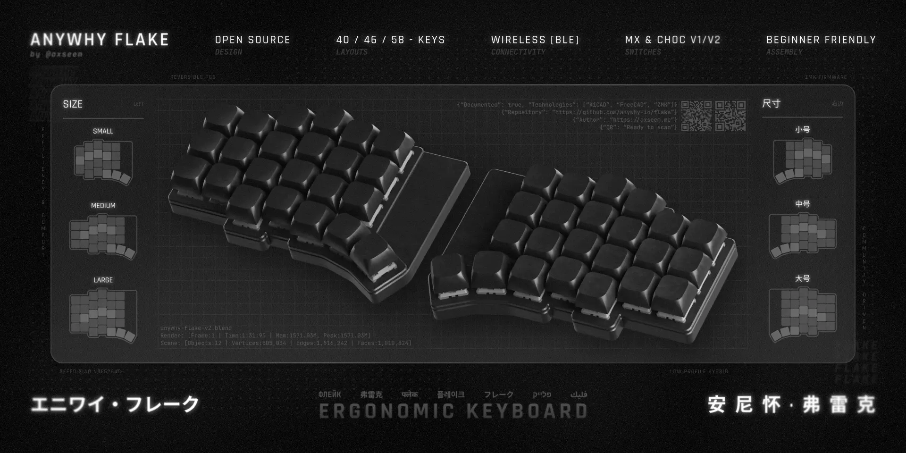

**English** | [简体中文](./docs/internationalization/Chinese/readme.md) | [Русский](./docs/internationalization/Russian/readme.md) | *`More languages are in progress!`*

***

    
    <h3>Anywhy Flake</h3>
    
<i>An open-source, wireless, split ergonomic keyboard designed to be productive, healthy, and enjoyable.</i>

    

        
        
        
    

## Why Flake?

By the 19th century, a need for a faster way of writing had emerged, leading to the invention of typewriters. Two centuries later, modern keyboards don't look much different, even though their monolithic, row-staggered design has been proven to be inefficient and often harmful.

The Flake keyboard addresses these problems from the ground up, providing huge benefits in comfort and efficiency for anyone who spends their day typing.

## Core Features

*   **Split Ergonomic Design:** Place each half where it feels best, eliminating wrist strain.
*   **Columnar Stagger:** Keys are arranged to follow the natural movement of your fingers.
*   **Wireless First:** True wireless freedom with Bluetooth LE powered by ZMK Firmware.
*   **Hybrid Hot-Swap:** Supports **MX**, **Kailh Choc v1** and **Kailh Choc v2** switches.
*   **Three Sizes:** Choose the layout that fits you perfectly: **Small (40)**, **Medium (46)**, or **Large (58)** keys.
*   **Ultra-Thin Profile:** An incredibly sleek and low-profile body for maximum comfort.
*   **Fully Open Source:** All hardware and software files are available for you to build, modify, and share.

## The Philosophy Behind the Design

### Split Layout
Regular keyboards force your forearms to converge, bending your wrists at an unnatural angle that can lead to long-term pain. A split keyboard allows you to position each half independently, aligning your hands, wrists, and forearms in a straight, comfortable line. As a bonus, you get free space between the halves for a trackpad, notebook, or even a cat =^..^=

### Columnar Stagger
Look at your hand - your fingers have different lengths and prefer to move up and down. Now look at a traditional keyboard - the keys are shifted horizontally. This "row stagger" forces your fingers to make awkward, unnatural movements. Flake uses a "columnar stagger", where each column is shifted vertically to match the natural reach of your fingers, resulting in a much more pleasant and efficient typing experience.

### Hybrid Switch Support
The world of mechanical switches is vast and exciting, but choosing just one type can be limiting. Flake solves this with hybrid hot-swap sockets. Each key position has sockets for both **Cherry MX-style** and **low-profile Kailh Choc** switches. This gives you the freedom to experiment with different switch types at any time.

To provide the best typing feel and stability for the taller MX switches, a dedicated switch plate is included with the case files. This plate is placed over the PCB before inserting the switches, ensuring they are held securely. Low-profile Choc switches mount directly and do not require the plate.

### Fewer Keys, More Power
A small key count might seem counterintuitive for productivity, but it's a core feature, not a compromise. Fewer keys mean your hands stay in one place, eliminating the need to stretch for distant keys.

This doesn't mean less functionality. Powered by the incredible [ZMK Firmware](https://zmk.dev), Flake uses [layers](https://zmk.dev/docs/keymaps#layers) to access every key a traditional keyboard has and more. You can have dedicated layers for numbers, symbols, navigation, macros, and anything else you can imagine, all just a thumb press away.

To accommodate different preferences, Flake comes in three sizes:
*   **Flake L (58 keys):** For those who prefer more dedicated keys.
*   **Flake M (46 keys):** A perfect balance of function and form.
*   **Flake S (40 keys):** For the ultimate in minimalism and ergonomics.

### Ultra-Thin Profile
The keyboard body is only **~9mm** thick (without feet). Combined with low-profile Choc switches and keycaps, this creates an extremely low-to-the-desk typing experience, further reducing wrist strain.

## Build Your Own Flake

Ready to build one? The comprehensive build guide has everything you need to get started.
➡️ **[Read the Official Build Guide](./docs/build_guide.md)**

Also, be sure to check out the gallery to see amazing builds from the community!
➡️ **[Explore the Gallery ✨](./docs/gallery.md)**

## Credits

Huge thanks to:
-   [@foostan](https://github.com/foostan) for the [Corne Keyboard](https://github.com/foostan/crkbd), my introduction to the world of ergonomic keyboards.
-   [@pashutk](https://github.com/pashutk) for the [Chocofi](https://github.com/pashutk/chocofi), an amazing tiny keyboard I've been using for a while.
-   [@josefadamcik](https://github.com/josefadamcik) for the [Sofle](https://github.com/josefadamcik/SofleKeyboard), which heavily inspired the Flake's key layout.
-   [@carrefinho](https://github.com/carrefinho) for the [Forager](https://github.com/carrefinho/forager). Its clever controller mount allowed v2 to use the Seeed Xiao controller while keeping the keyboard thin.
-   [@ebastler](https://github.com/ebastler/) for his amazing [marbastlib](https://github.com/ebastler/marbastlib), which is used as the basis for the switch footprints.
-   [@petejohanson](https://github.com/petejohanson) and all the [contributors](https://github.com/zmkfirmware/zmk/graphs/contributors) for creating and maintaining the incredible [ZMK Firmware](https://github.com/zmkfirmware/zmk).
-   Everyone working on [KiCad](https://gitlab.com/kicad/code/kicad) and [FreeCAD](https://github.com/FreeCAD/FreeCAD) for creating such powerful open source tools.
-   The helpful and kind people from the [ZMK Discord server](https://zmk.dev/community/discord/invite) who helped me learn PCB design and solve countless problems.
-   Thank you to everyone who explores unpopular technologies, digs into niche topics, and makes amazing things possible.

## Stars

Leaving a star is the simplest way to support the project!

stars go brrr...