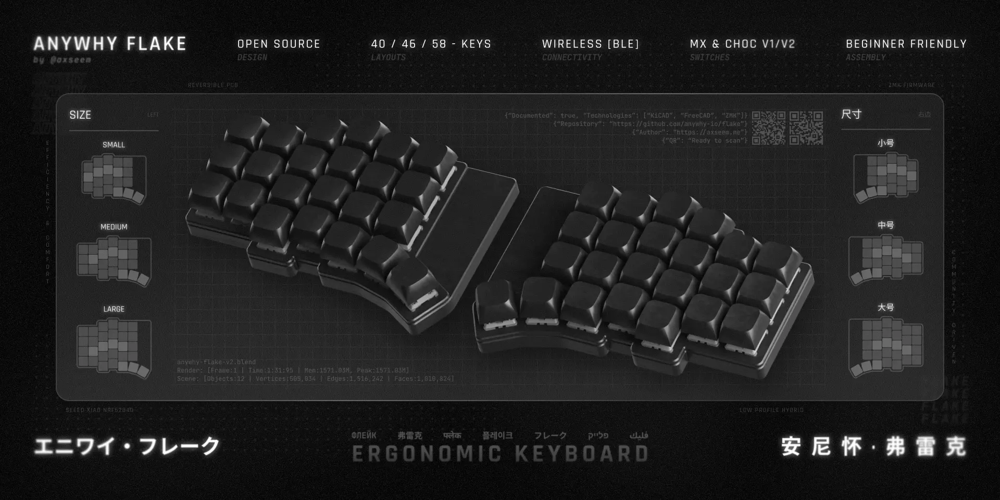

# Anywhy Flake

    
    
<i>An open-source, wireless, split ergonomic keyboard designed to be productive, healthy, and enjoyable.</i>

    

        
        
        
    

## Documentation

Full documentation lives in [`docs/`](./docs) and on the
[Anywhy website](https://anywhy.io/wiki/flake).

- [Build Guide](./docs/build_guide.md)
- [Essential Files](./docs/essential_files.md)
- [Gallery](./docs/gallery.md)
- [Flashing Guide](https://github.com/anywhy-io/flake-firmware/blob/main/docs/flashing_guide.md)

## License

GPL-3.0. See [LICENSE](./LICENSE).
