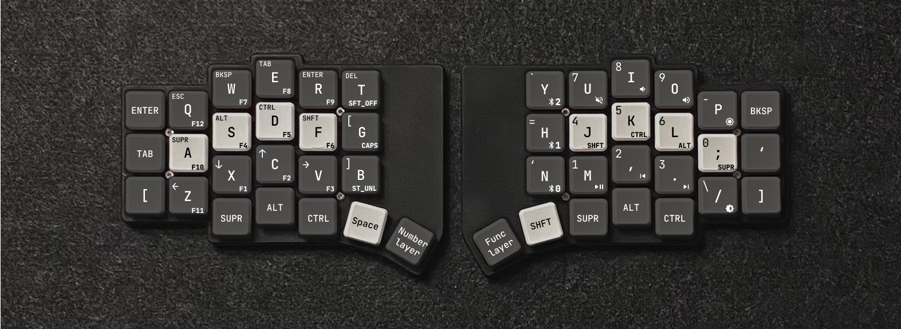

**Anywhy Flake**

_An open, programmable, wireless, ergonomic keyboard_

## Features

- All docs and design files are public. Parts are standard and replaceable.
- Three sizes: S (40 keys), M (46), or L (58).
- Hybrid hot-swap sockets fit low- and high-profile switches: MX, Choc v1, Choc v2, GLP v3.
- Remap any key. Add layers, macros, and combos.
- The case is 9 mm thick, without switches or feet.
- The two halves link over Bluetooth, and your device connects over Bluetooth or USB-C.
- A single charge gives 4 weeks on the main half and 6 months on the secondary.[^battery]

## Documentation

- [Gallery](./docs/gallery.md)
- [Manufacturing Files](./docs/manufacturing_files.md)
- [Build Guide](./docs/build_guide.md)
- [Flashing Guide](https://github.com/anywhy-io/flake-firmware/blob/main/docs/flashing_guide.md)

## License

CERN-OHL-W-2.0. See [LICENSE](./LICENSE).

[^battery]: Assumes 12 hours of continuous use per day, every day.
